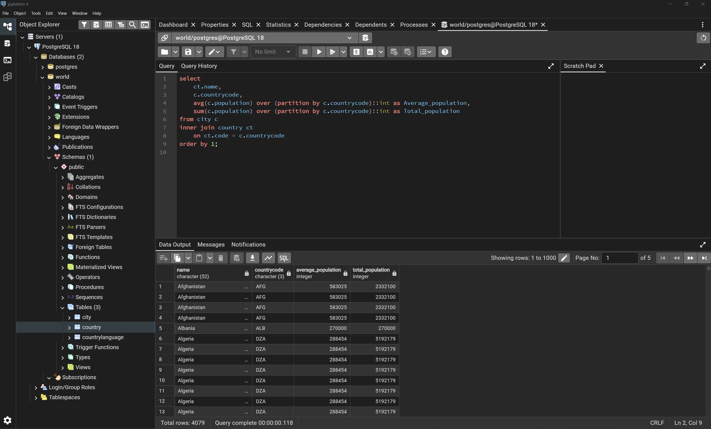
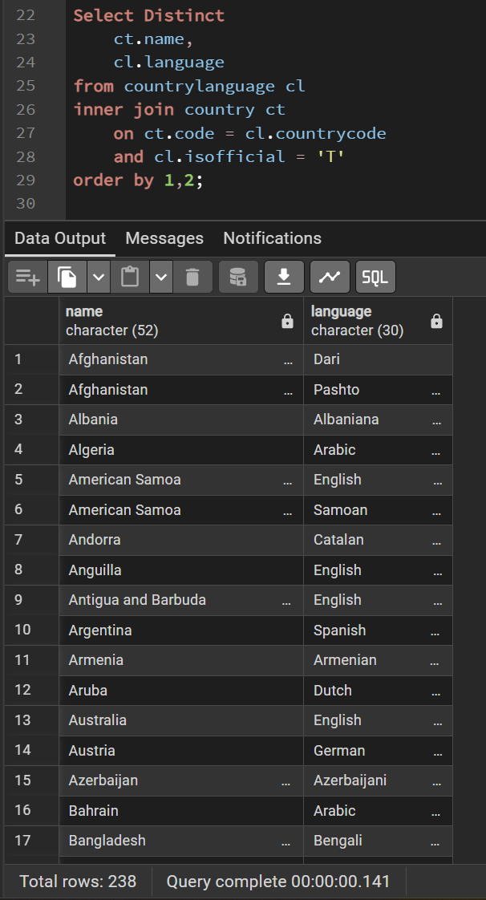
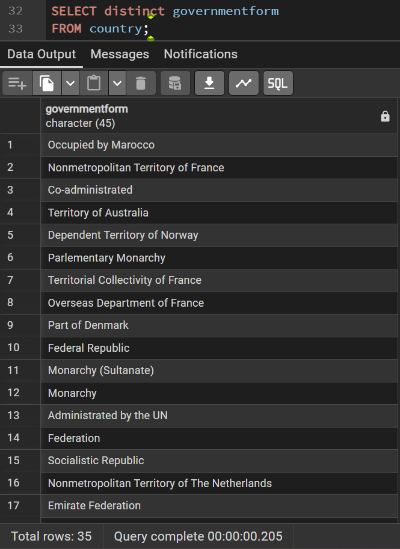
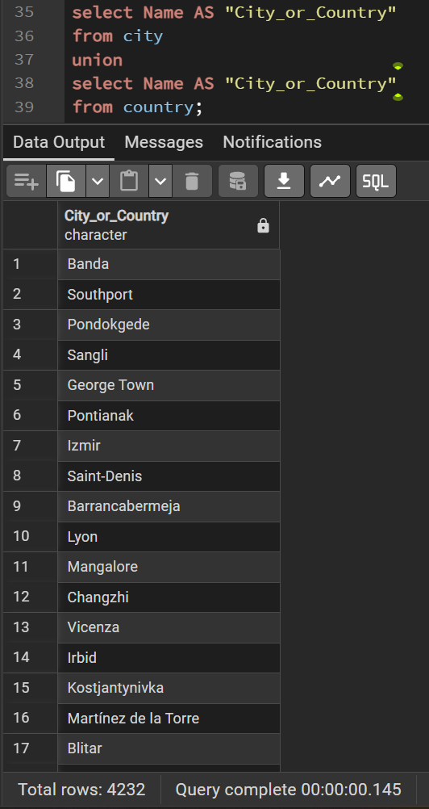
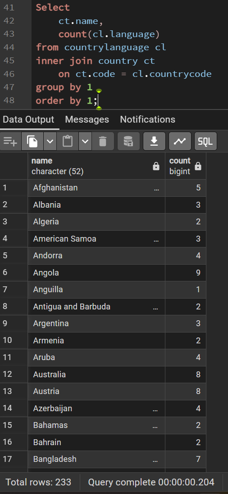
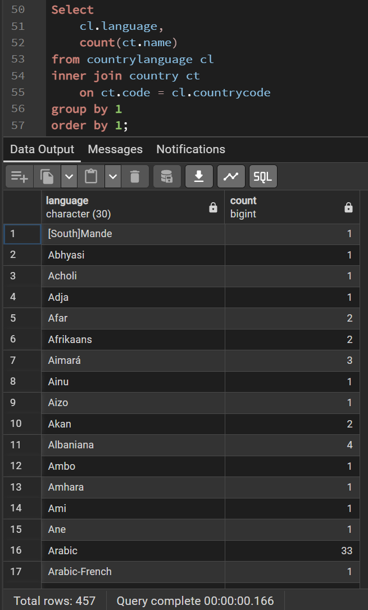
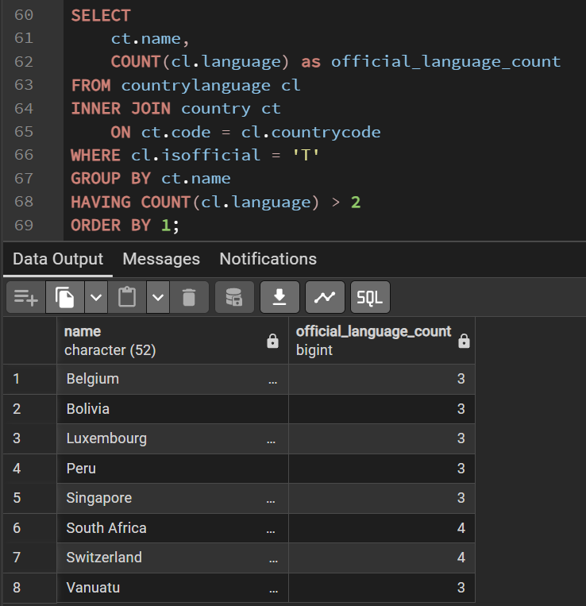
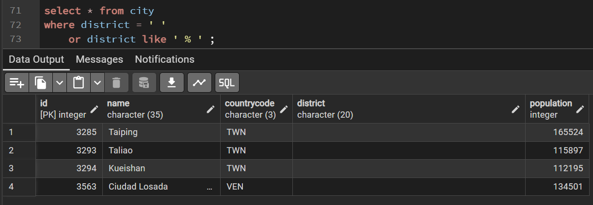
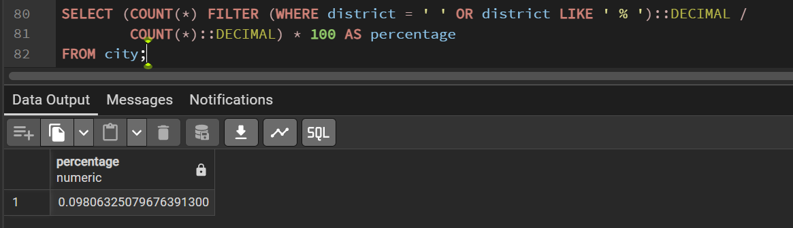

# Exercise 02: World Database – Joins, Grouping, and Data Quality

- Name: Venkat Teja Nallamothu
- Course: Database for Analytics
- Module: 2
- Database Used: World Database (PostgreSQL)

---

## Instructions

- Answer each question below using SQL executed against the **World database**.
- All SQL commands **must be run by you**.
- For each SQL-based question:
  - Include the SQL command in a fenced code block
  - Include a **screenshot** showing the command and its results
- Store screenshots in the `screenshots/` folder and embed them below each answer.

---

## Question 1

When importing records from `worldPGSQL.sql`, **how many cities were imported**?

### Answer
_Write the number of cities imported._

### Screenshot
_Show evidence of how you determined this (for example, a COUNT query)._

```sql
  SELECT
    COUNT(*) AS number_cities_imported
  FROM city;
```



---

## Question 2

Using the World database, write the SQL command to **display each country name along with the name of each language spoken in that country**.

### SQL

```sql
  Select Distinct
    ct.name,
    cl.language
  from countrylanguage cl
  inner join country ct
    on ct.code = cl.countrycode
  order by 1,2;
```

### Screenshot


---

## Question 3

Using the World database, write the SQL command to **display each country name along with the name of each official language spoken in that country**.

### SQL

```sql
  Select Distinct
    ct.name,
    cl.language
  from countrylanguage cl
  inner join country ct
    on ct.code = cl.countrycode
    and cl.isofficial = 'T'
  order by 1,2;
```

### Screenshot



---

## Question 4

Consider the following two SQL statements:

```sql
SELECT *
FROM country, countrylanguage
WHERE country.code = countrylanguage.countrycode;
```

```sql
SELECT *
FROM country
LEFT OUTER JOIN countrylanguage
ON country.code = countrylanguage.countrycode;
```

**In your own words**, describe what data the **second query returns that the first query does not**.

### Answer
_Using a LEFT OUTER JOIN lists every country whether or not it has language data, whereas the comma-style/INNER JOIN only lists countries that have corresponding language rows_

---

## Question 5

Using the World database, write the SQL command to **list all different forms of government** found in the data.
Do **not** repeat any form of government more than once.

### SQL

```sql
  SELECT distinct governmentform FROM country;
```

### Screenshot



---

## Question 6

Using the World database, write the SQL command to **list all names of cities and countries in one column**.
Label the column **"City or Country Name"**.

### SQL

```sql
  select Name AS "City_or_Country"
  from city
  union
  select Name AS "City_or_Country"
  from country;
```

### Screenshot



---

## Question 7

Using the World database, write the SQL command to **list all countries by name**, along with the **number of languages spoken in each country**.
Be sure to **sort by country name**.

### SQL

```sql
  Select
    ct.name,
    count(cl.language)
  from countrylanguage cl
  inner join country ct
    on ct.code = cl.countrycode
  group by 1
  order by 1;
```

### Screenshot



---

## Question 8

Using the World database, write the SQL command to **list all languages**, along with the **number of countries where each language is spoken**.
Be sure to **sort by language name**.

### SQL

```sql
  Select
    cl.language,
    count(ct.name)
  from countrylanguage cl
  inner join country ct
    on ct.code = cl.countrycode
  group by 1
  order by 1;
```

### Screenshot



---

## Question 9

Using the World database, write the SQL command to **list countries that have more than two official languages**, along with the **number of official languages spoken**.

*Hint: There are 8 such countries in this dataset.*

### SQL

```sql
  SELECT
      ct.name,
      COUNT(cl.language) as official_language_count
  FROM countrylanguage cl
  INNER JOIN country ct
      ON ct.code = cl.countrycode
  WHERE cl.isofficial = 'T'
  GROUP BY ct.name
  HAVING COUNT(cl.language) > 2
  ORDER BY 1;
```

### Screenshot



---

## Question 10

Using the World database, write the SQL command to **find cities where the district value is missing**.

*Hint: Use `LIKE` and the dash (`-`) since some rows use that instead of actual data.*

### SQL

```sql
  select * from city
  where district = ' '
    or district like ' % ' ;
```

### Screenshot



---

## Question 11

Using the World database, write the SQL command to **calculate the percentage of cities with missing district values**.

*Hint: The result should be approximately 0.4%.*

### SQL

```sql
  SELECT (COUNT(*) FILTER (WHERE district = ' ' OR district LIKE ' % ')::DECIMAL /
          COUNT(*)::DECIMAL) * 100 AS percentage
  FROM city;
```

### Screenshot


