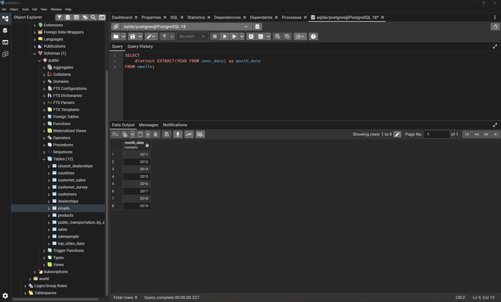
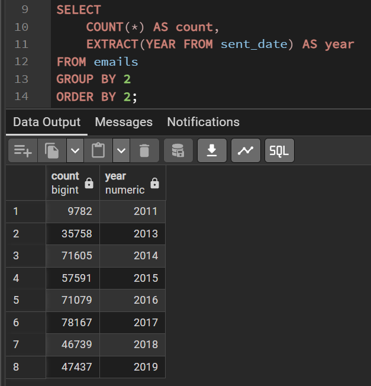
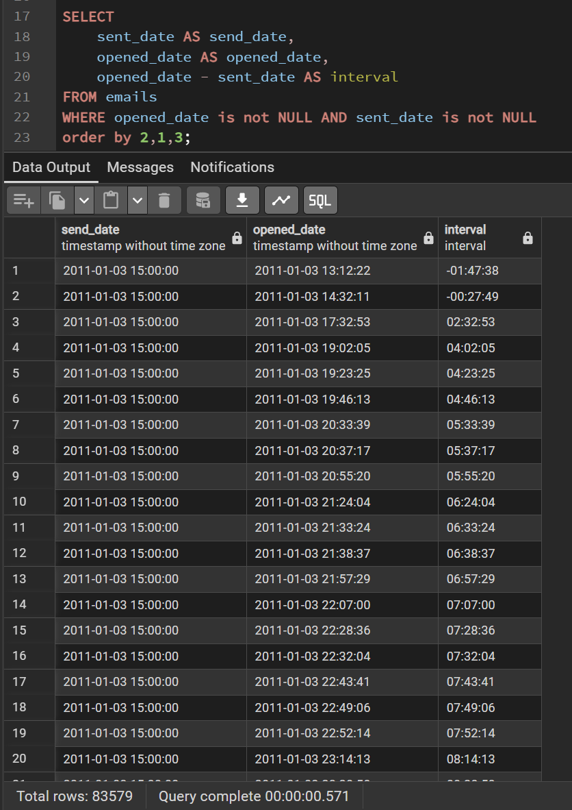
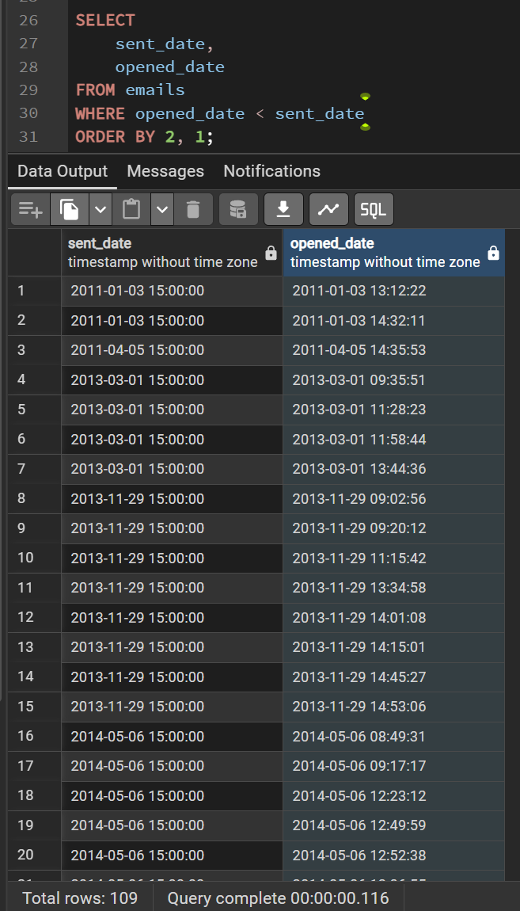
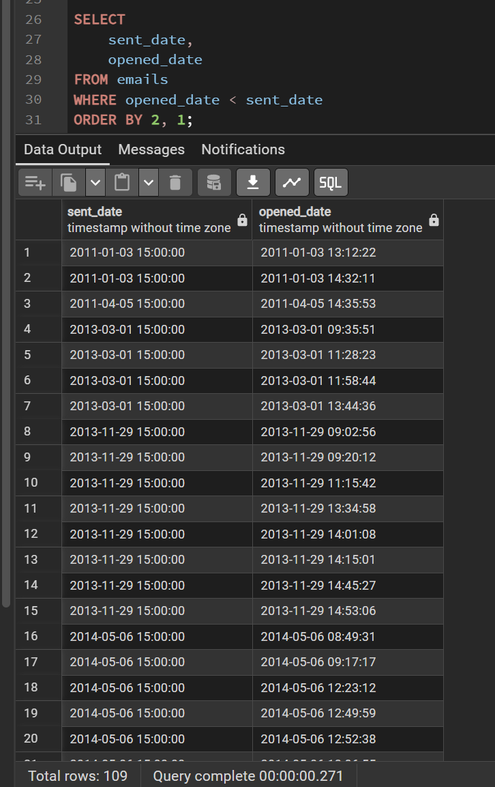
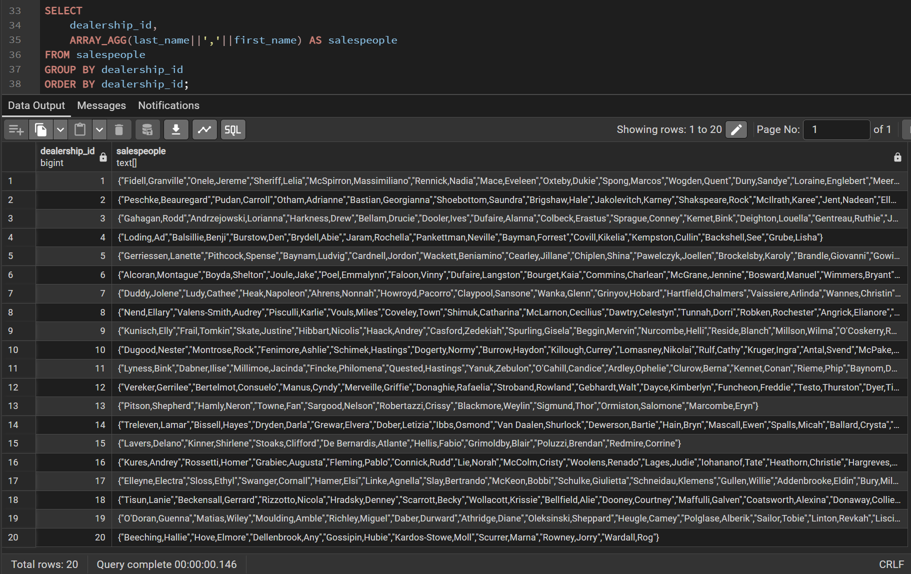
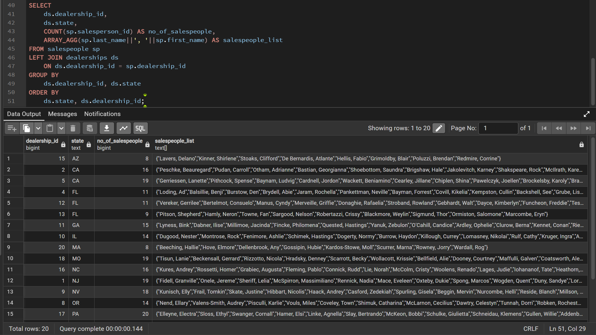
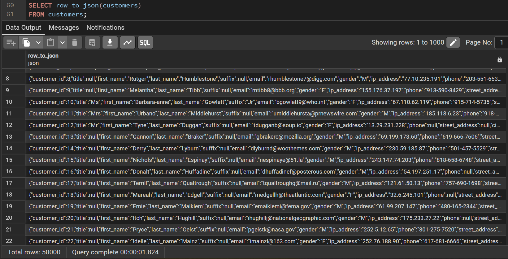
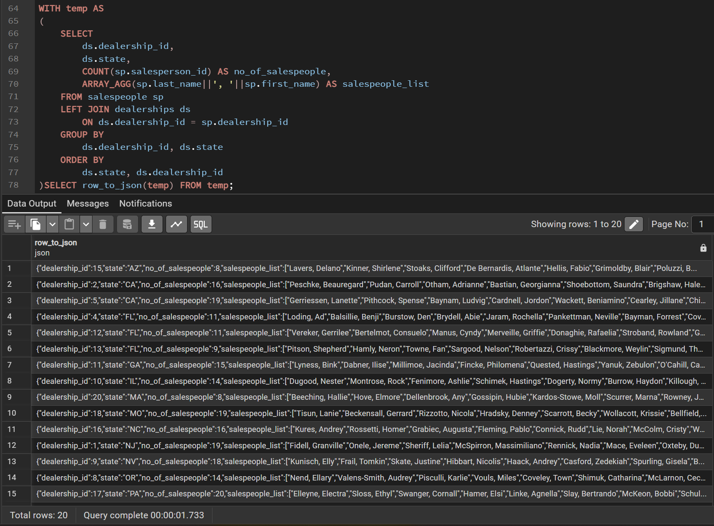

# Exercise 05: SQLDA Database - Dates, Data Quality, Arrays, and JSON

- Name:  Venkat Teja Nallamothu
- Course: Database for Analytics
- Module: 5
- Database Used:  `sqlda` (Sample Datasets)
- Tools Used: PostgreSQL (pgAdmin or psql)

---

## Instructions

- Use the **sqlda** database from the "Loading the Sample Datasets" instructions.
- For each SQL task:
  - Include your SQL in a fenced code block
  - Execute it and include a **screenshot** showing the query and results
- Store screenshots in the `screenshots/` folder and embed them below each answer.
- For explanation questions:
  - Write your answer in complete sentences
  - Include a screenshot if requested

---

## Question 1

Using the `sqlda` database, write the SQL needed to show a **list of years** that emails were sent.

Your results should list years like this (order matters):

```
year
2011
2013
2014
2015
2016
2017
2018
2019
```

### SQL

```
    SELECT
        distinct EXTRACT(YEAR FROM sent_date) as month_date
    FROM emails;
```

### Screenshot



---

## Question 2

Using the `sqlda` database, write the SQL needed to show the **number of messages sent by year**, ordered by year (as shown in the prompt).

Output should resemble:

```
count   year
...
```

### SQL

```
    SELECT
        COUNT(*) AS count,
        EXTRACT(YEAR FROM sent_date) AS year
    FROM emails
    GROUP BY 2
    ORDER BY 2;
```

### Screenshot



---

## Question 3

Using the `sqlda` database, write the SQL needed to show:
- the **sent date**
- the **opened date**
- the **interval** between the two

Only include emails that contain **both** a sent date and an opened date.

### SQL

```
    SELECT
        sent_date AS send_date,
        opened_date AS opened_date,
        opened_date - sent_date AS interval
    FROM emails
    WHERE opened_date is not NULL AND sent_date is not NULL
    order by 2,1,3;
```

### Screenshot



---

## Question 4

Using the `sqlda` database, write the SQL needed to show emails that contain an **opened date BEFORE the sent date**.

### SQL

```
    SELECT
        sent_date,
        opened_date
    FROM emails
    WHERE opened_date < sent_date
    ORDER BY 2, 1;
```

### Screenshot



---

## Question 5

Using the `sqlda` database: there are **over 100 emails** that contain an opened date **BEFORE** the sent date.

After looking at the data, **why is this the case?**

### Answer

_Timezone mismatch -_
* Sent_date and opened_date were recorded in different timezones without proper conversion
* Clock synchronization issues - different servers had unsynchronized system clocks
* Data migration problems - timestamps were incorrectly converted or lost timezone info during import
* Default/batch timestamps - the consistent 15:00:00 times suggest placeholder values rather than actual send times

### Screenshot (if requested by instructor)



---

## Question 6

Using the `sqlda` database, explain in your own words what the following code does:

```
CREATE TEMP TABLE customer_points AS (
    SELECT
        customer_id,
        point(longitude, latitude) AS lng_lat_point
    FROM customers
    WHERE longitude IS NOT NULL
    AND latitude IS NOT NULL
);

CREATE TEMP TABLE dealership_points AS (
    SELECT
        dealership_id,
        point(longitude, latitude) AS lng_lat_point
    FROM dealerships
);

CREATE TEMP TABLE customer_dealership_distance AS (
    SELECT
       customer_id,
       dealership_id,
       c.lng_lat_point <@> d.lng_lat_point AS distance
    FROM customer_points c
    CROSS JOIN dealership_points d
);
```

### Answer

_This code creates a distance matrix between all customers and all dealerships:_
* First table - Creates a temporary table storing each customer's location as a geometric point (excluding customers without coordinates)
* Second table - Creates a temporary table storing each dealership's location as a geometric point
* Third table - Calculates the distance between every customer and every dealership by cross-joining the two point tables, using the <@> operator to compute the Euclidean distance between each pair of points

---

## Question 7

Using the `sqlda` database, write SQL to display an **array of salespeople for each dealership**, sorted by dealership.

For example - dealership 1 is below:

```text
"{""Fidell,Granville"",""Onele,Jereme"",""Sheriff,Lelia"",""McSpirron,Massimiliano"",""Rennick,Nadia"",""Mace,Eveleen"",""Oxteby,Dukie"",""Spong,Marcos"",""Wogden,Quent"",""Duny,Sandye"",""Loraine,Englebert"",""Meere,Ira"",""Gibbens,Cristine"",""Prine,Lyda"",""McCoughan,Sheff"",""Schule,Giselbert"",""McAndie,Eleen"",""Dosedale,Dorie"",""Nafziger,Shay""}"
```

### SQL

```sql
    SELECT
        dealership_id,
        ARRAY_AGG(last_name||','||first_name) AS salespeople
    FROM salespeople
    GROUP BY dealership_id
    ORDER BY dealership_id;
```

### Screenshot



---

## Question 8

Using the `sqlda` database, write SQL to display:
- an **array of salespeople for each dealership**
- the **state** of the dealership
- the **number of salespeople** for the dealership

Sort by **state**.

Reference image:


### SQL

```
    SELECT
        ds.dealership_id,
        ds.state,
        COUNT(sp.salesperson_id) AS no_of_salespeople,
        ARRAY_AGG(sp.last_name||', '||sp.first_name) AS salespeople_list
    FROM salespeople sp
    LEFT JOIN dealerships ds
        ON ds.dealership_id = sp.dealership_id
    GROUP BY
        ds.dealership_id, ds.state
    ORDER BY
        ds.state, ds.dealership_id;
```

### Screenshot



---

## Question 9

Using the `sqlda` database, write the SQL needed to convert the **customers** table to **JSON**.

### SQL

```
    SELECT row_to_json(customers)
    FROM customers;
```

### Screenshot



---

## Question 10

Using the `sqlda` database, write SQL to display:
- an **array of salespeople for each dealership**
- the **state**
- the **number of salespeople**
- sorted by **state**

Then **convert this result to JSON**.

Reference image:


### SQL

```
    WITH temp AS
    (
        SELECT
            ds.dealership_id,
            ds.state,
            COUNT(sp.salesperson_id) AS no_of_salespeople,
            ARRAY_AGG(sp.last_name||', '||sp.first_name) AS salespeople_list
        FROM salespeople sp
        LEFT JOIN dealerships ds
            ON ds.dealership_id = sp.dealership_id
        GROUP BY
            ds.dealership_id, ds.state
        ORDER BY
            ds.state, ds.dealership_id
    )SELECT row_to_json(temp) FROM temp;
```

### Screenshot


