# Module 7 - 44661 Final Project Submission

---
### COVID-19 Database — Our World in Data
---

## Student Information

**1. Name:** Venkat Teja Nallamothu
**2. Course:** Database for Analytics

---

## Project Overview

For this project, I used the **Our World in Data COVID-19 dataset**, which contains global pandemic data including case counts, deaths, hospitalizations, and vaccination records across 200+ countries from 2020 to 2023.

**Data Source:** https://github.com/owid/covid-19-data
* locations - https://raw.githubusercontent.com/owid/covid-19-data/master/public/data/vaccinations/locations.csv
* vaccinations - https://raw.githubusercontent.com/owid/covid-19-data/master/public/data/vaccinations/vaccinations.csv
* covid_cases - https://raw.githubusercontent.com/owid/covid-19-data/master/public/data/owid-covid-data.csv

---

## Database Structure

**Database Name:** `covid`

**Tables:**
| Table | Source File | Row Count | Role |
|---|---|---|---|
| `locations` | locations.csv | ~230 rows | Country reference table |
| `vaccinations` | vaccinations.csv | 100,000+ rows | Vaccination time-series |
| `covid_cases` | owid-covid-data.csv | 200,000+ rows | Daily case/death data |

---

## Step 1 — Data Loaded & Row Count Verification

**SQL Used:**
```sql
SELECT 'locations'    AS table_name, COUNT(*) AS row_count FROM locations
UNION ALL
SELECT 'vaccinations',                COUNT(*) FROM vaccinations
UNION ALL
SELECT 'covid_cases',                 COUNT(*) FROM covid_cases;
```

**Screenshot:**

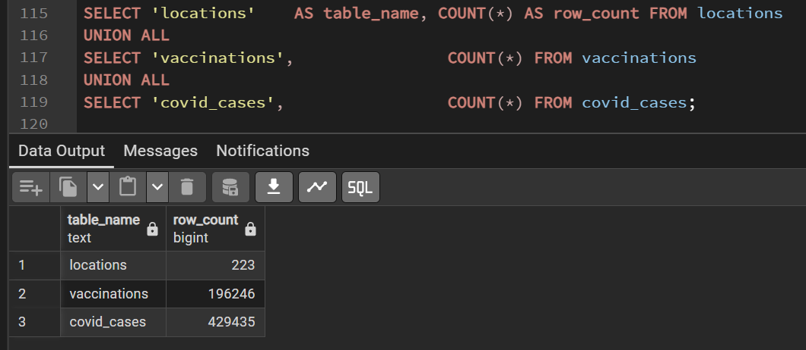

---

## Step 2 — Table Creation (VARCHAR First Pass)

Following the same approach shown in the course example, I first created all tables using `VARCHAR` data types to ensure the data loaded without errors, then re-created them with proper types after verifying the data.

**SQL Used — locations table:**
```sql
CREATE TABLE locations (
    location              VARCHAR(255),
    iso_code              VARCHAR(20),
    vaccines              VARCHAR(500),
    last_observation_date VARCHAR(20),
    source_name           VARCHAR(255),
    source_website        VARCHAR(500)
);
```
**Screenshot — Tables created in pgAdmin:**

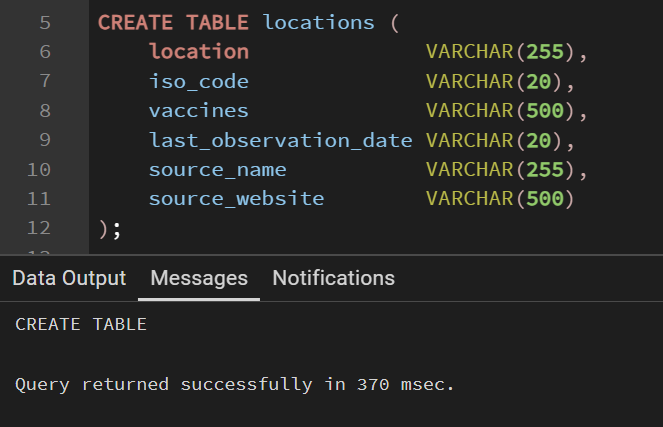

**SQL Used — vaccinations table:**
```sql
CREATE TABLE vaccinations (
    location                                VARCHAR(255),
    iso_code                                VARCHAR(20),
    vax_date                                VARCHAR(20),
    total_vaccinations                      VARCHAR(50),
    people_vaccinated                       VARCHAR(50),
    people_fully_vaccinated                 VARCHAR(50),
    total_boosters                          VARCHAR(50),
    daily_vaccinations_raw                  VARCHAR(50),
    daily_vaccinations                      VARCHAR(50),
    total_vaccinations_per_hundred          VARCHAR(50),
    people_vaccinated_per_hundred           VARCHAR(50),
    people_fully_vaccinated_per_hundred     VARCHAR(50),
    total_boosters_per_hundred              VARCHAR(50),
    daily_vaccinations_per_million          VARCHAR(50),
    daily_people_vaccinated                 VARCHAR(50),
    daily_people_vaccinated_per_hundred     VARCHAR(50)
);
```
**Screenshot — Tables created in pgAdmin:**

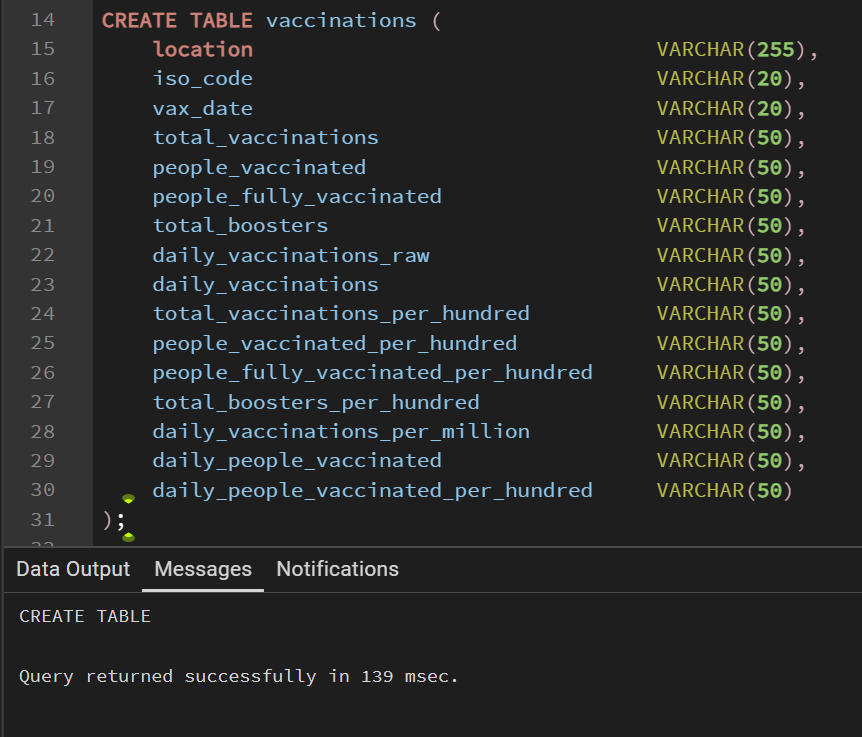

**SQL Used — covid_cases table (all 67 columns):**
```sql
CREATE TABLE covid_cases (
    iso_code                                VARCHAR(20),
    continent                               VARCHAR(100),
    location                                VARCHAR(255),
    case_date                               VARCHAR(20),
    total_cases                             VARCHAR(50),
    new_cases                               VARCHAR(50),
    new_cases_smoothed                      VARCHAR(50),
    total_deaths                            VARCHAR(50),
    new_deaths                              VARCHAR(50),
    new_deaths_smoothed                     VARCHAR(50),
    total_cases_per_million                 VARCHAR(50),
    new_cases_per_million                   VARCHAR(50),
    new_cases_smoothed_per_million          VARCHAR(50),
    total_deaths_per_million                VARCHAR(50),
    new_deaths_per_million                  VARCHAR(50),
    new_deaths_smoothed_per_million         VARCHAR(50),
    reproduction_rate                       VARCHAR(50),
    icu_patients                            VARCHAR(50),
    icu_patients_per_million                VARCHAR(50),
    hosp_patients                           VARCHAR(50),
    hosp_patients_per_million               VARCHAR(50),
    weekly_icu_admissions                   VARCHAR(50),
    weekly_icu_admissions_per_million       VARCHAR(50),
    weekly_hosp_admissions                  VARCHAR(50),
    weekly_hosp_admissions_per_million      VARCHAR(50),
    total_tests                             VARCHAR(50),
    new_tests                               VARCHAR(50),
    total_tests_per_thousand                VARCHAR(50),
    new_tests_per_thousand                  VARCHAR(50),
    new_tests_smoothed                      VARCHAR(50),
    new_tests_smoothed_per_thousand         VARCHAR(50),
    positive_rate                           VARCHAR(50),
    tests_per_case                          VARCHAR(50),
    tests_units                             VARCHAR(100),
    total_vaccinations                      VARCHAR(50),
    people_vaccinated                       VARCHAR(50),
    people_fully_vaccinated                 VARCHAR(50),
    total_boosters                          VARCHAR(50),
    new_vaccinations                        VARCHAR(50),
    new_vaccinations_smoothed               VARCHAR(50),
    total_vaccinations_per_hundred          VARCHAR(50),
    people_vaccinated_per_hundred           VARCHAR(50),
    people_fully_vaccinated_per_hundred     VARCHAR(50),
    total_boosters_per_hundred              VARCHAR(50),
    new_vaccinations_smoothed_per_million   VARCHAR(50),
    new_people_vaccinated_smoothed          VARCHAR(50),
    new_people_vaccinated_smoothed_per_hundred VARCHAR(50),
    stringency_index                        VARCHAR(50),
    population_density                      VARCHAR(50),
    median_age                              VARCHAR(50),
    aged_65_older                           VARCHAR(50),
    aged_70_older                           VARCHAR(50),
    gdp_per_capita                          VARCHAR(50),
    extreme_poverty                         VARCHAR(50),
    cardiovasc_death_rate                   VARCHAR(50),
    diabetes_prevalence                     VARCHAR(50),
    female_smokers                          VARCHAR(50),
    male_smokers                            VARCHAR(50),
    handwashing_facilities                  VARCHAR(50),
    hospital_beds_per_thousand              VARCHAR(50),
    life_expectancy                         VARCHAR(50),
    human_development_index                 VARCHAR(50),
    population                              VARCHAR(50),
    excess_mortality_cumulative_absolute    VARCHAR(50),
    excess_mortality_cumulative             VARCHAR(50),
    excess_mortality                        VARCHAR(50),
    excess_mortality_cumulative_per_million VARCHAR(50)
);
```

**Screenshot — Tables created in pgAdmin:**

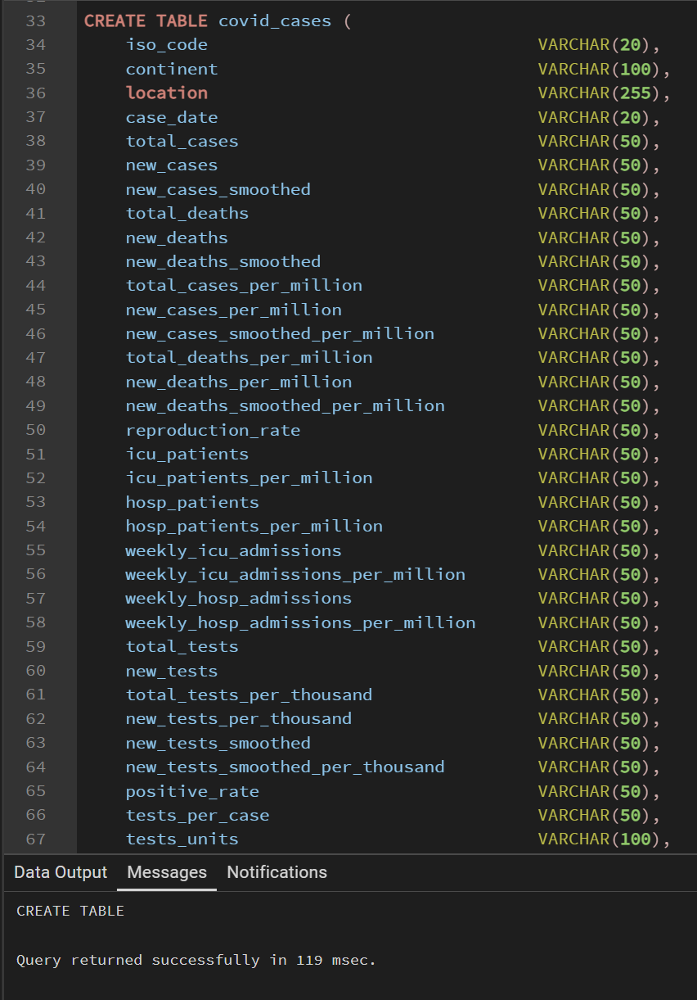

---

## Step 3 — Loading CSV Files with COPY

```sql
COPY locations
FROM 'C:\GitHub_Repo\P7_CSV\locations.csv'
DELIMITER ','
CSV HEADER;

COPY vaccinations
FROM 'C:\GitHub_Repo\P7_CSV\vaccinations.csv'
DELIMITER ','
CSV HEADER;

COPY covid_cases
FROM 'C:\GitHub_Repo\P7_CSV\owid-covid-data.csv'
DELIMITER ','
CSV HEADER;
```

**Screenshot — Successful COPY output:**

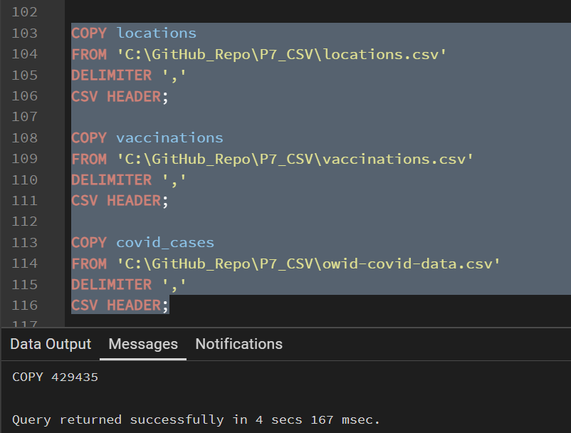

---

## Step 4 — Data Type Upgrade (Final Tables)

After confirming data loaded correctly, I exported clean files and re-created tables with proper data types (DATE, NUMERIC, VARCHAR).

```sql
-- ============================================================
-- STEP 4: FULL DATA TYPE UPGRADE
-- ============================================================

-- 1. Drop all tables (children first, then parent)
DROP TABLE IF EXISTS covid_cases;
DROP TABLE IF EXISTS vaccinations;
DROP TABLE IF EXISTS locations;

-- ============================================================
-- 2. Recreate all 3 tables with proper data types
-- ============================================================

CREATE TABLE locations (
    location              VARCHAR(255),
    iso_code              VARCHAR(20) PRIMARY KEY,
    vaccines              VARCHAR(500),
    last_observation_date DATE,
    source_name           VARCHAR(255),
    source_website        VARCHAR(500)
);

CREATE TABLE vaccinations (
    location                            VARCHAR(255),
    iso_code                            VARCHAR(20),
    vax_date                            DATE,
    total_vaccinations                  NUMERIC,
    people_vaccinated                   NUMERIC,
    people_fully_vaccinated             NUMERIC,
    total_boosters                      NUMERIC,
    daily_vaccinations_raw              NUMERIC,
    daily_vaccinations                  NUMERIC,
    total_vaccinations_per_hundred      NUMERIC,
    people_vaccinated_per_hundred       NUMERIC,
    people_fully_vaccinated_per_hundred NUMERIC,
    total_boosters_per_hundred          NUMERIC,
    daily_vaccinations_per_million      NUMERIC,
    daily_people_vaccinated             NUMERIC,
    daily_people_vaccinated_per_hundred NUMERIC,
    PRIMARY KEY (iso_code, vax_date)
);

CREATE TABLE covid_cases (
    iso_code                 VARCHAR(20),
    continent                VARCHAR(100),
    location                 VARCHAR(255),
    case_date                DATE,
    total_cases              NUMERIC,
    new_cases                NUMERIC,
    new_cases_smoothed       NUMERIC,
    total_deaths             NUMERIC,
    new_deaths               NUMERIC,
    new_deaths_smoothed      NUMERIC,
    total_cases_per_million  NUMERIC,
    new_cases_per_million    NUMERIC,
    total_deaths_per_million NUMERIC,
    new_deaths_per_million   NUMERIC,
    reproduction_rate        NUMERIC,
    icu_patients             NUMERIC,
    hosp_patients            NUMERIC,
    total_tests              NUMERIC,
    new_tests                NUMERIC,
    positive_rate            NUMERIC,
    tests_units              VARCHAR(100),
    total_vaccinations       NUMERIC,
    people_vaccinated        NUMERIC,
    people_fully_vaccinated  NUMERIC,
    stringency_index         NUMERIC,
    population               NUMERIC,
    population_density       NUMERIC,
    median_age               NUMERIC,
    gdp_per_capita           NUMERIC,
    life_expectancy          NUMERIC,
    human_development_index  NUMERIC,
    PRIMARY KEY (iso_code, case_date)
);

-- ============================================================
-- 3. Load locations
-- ============================================================

COPY locations (location, iso_code, vaccines, last_observation_date, source_name, source_website)
FROM 'C:\GitHub_Repo\P7_CSV\locations.csv'
DELIMITER ',' CSV HEADER;

-- ============================================================
-- 4. Load vaccinations
-- ============================================================

COPY vaccinations (location, iso_code, vax_date, total_vaccinations, people_vaccinated,
    people_fully_vaccinated, total_boosters, daily_vaccinations_raw, daily_vaccinations,
    total_vaccinations_per_hundred, people_vaccinated_per_hundred,
    people_fully_vaccinated_per_hundred, total_boosters_per_hundred,
    daily_vaccinations_per_million, daily_people_vaccinated,
    daily_people_vaccinated_per_hundred)
FROM 'C:\GitHub_Repo\P7_CSV\vaccinations.csv'
DELIMITER ',' CSV HEADER;

-- ============================================================
-- 5. Load covid_cases via staging table (handles all 67 columns)
-- ============================================================

CREATE TABLE covid_cases_staging (
    iso_code                                VARCHAR(20),
    continent                               VARCHAR(100),
    location                                VARCHAR(255),
    case_date                               VARCHAR(20),
    total_cases                             VARCHAR(50),
    new_cases                               VARCHAR(50),
    new_cases_smoothed                      VARCHAR(50),
    total_deaths                            VARCHAR(50),
    new_deaths                              VARCHAR(50),
    new_deaths_smoothed                     VARCHAR(50),
    total_cases_per_million                 VARCHAR(50),
    new_cases_per_million                   VARCHAR(50),
    new_cases_smoothed_per_million          VARCHAR(50),
    total_deaths_per_million                VARCHAR(50),
    new_deaths_per_million                  VARCHAR(50),
    new_deaths_smoothed_per_million         VARCHAR(50),
    reproduction_rate                       VARCHAR(50),
    icu_patients                            VARCHAR(50),
    icu_patients_per_million                VARCHAR(50),
    hosp_patients                           VARCHAR(50),
    hosp_patients_per_million               VARCHAR(50),
    weekly_icu_admissions                   VARCHAR(50),
    weekly_icu_admissions_per_million       VARCHAR(50),
    weekly_hosp_admissions                  VARCHAR(50),
    weekly_hosp_admissions_per_million      VARCHAR(50),
    total_tests                             VARCHAR(50),
    new_tests                               VARCHAR(50),
    total_tests_per_thousand                VARCHAR(50),
    new_tests_per_thousand                  VARCHAR(50),
    new_tests_smoothed                      VARCHAR(50),
    new_tests_smoothed_per_thousand         VARCHAR(50),
    positive_rate                           VARCHAR(50),
    tests_per_case                          VARCHAR(50),
    tests_units                             VARCHAR(100),
    total_vaccinations                      VARCHAR(50),
    people_vaccinated                       VARCHAR(50),
    people_fully_vaccinated                 VARCHAR(50),
    total_boosters                          VARCHAR(50),
    new_vaccinations                        VARCHAR(50),
    new_vaccinations_smoothed               VARCHAR(50),
    total_vaccinations_per_hundred          VARCHAR(50),
    people_vaccinated_per_hundred           VARCHAR(50),
    people_fully_vaccinated_per_hundred     VARCHAR(50),
    total_boosters_per_hundred              VARCHAR(50),
    new_vaccinations_smoothed_per_million   VARCHAR(50),
    new_people_vaccinated_smoothed          VARCHAR(50),
    new_people_vaccinated_smoothed_per_hundred VARCHAR(50),
    stringency_index                        VARCHAR(50),
    population_density                      VARCHAR(50),
    median_age                              VARCHAR(50),
    aged_65_older                           VARCHAR(50),
    aged_70_older                           VARCHAR(50),
    gdp_per_capita                          VARCHAR(50),
    extreme_poverty                         VARCHAR(50),
    cardiovasc_death_rate                   VARCHAR(50),
    diabetes_prevalence                     VARCHAR(50),
    female_smokers                          VARCHAR(50),
    male_smokers                            VARCHAR(50),
    handwashing_facilities                  VARCHAR(50),
    hospital_beds_per_thousand              VARCHAR(50),
    life_expectancy                         VARCHAR(50),
    human_development_index                 VARCHAR(50),
    population                              VARCHAR(50),
    excess_mortality_cumulative_absolute    VARCHAR(50),
    excess_mortality_cumulative             VARCHAR(50),
    excess_mortality                        VARCHAR(50),
    excess_mortality_cumulative_per_million VARCHAR(50)
);

-- Load all 67 columns into staging
COPY covid_cases_staging
FROM 'C:\GitHub_Repo\P7_CSV\owid-covid-data.csv'
DELIMITER ',' CSV HEADER;

-- Confirm staging loaded
SELECT COUNT(*) AS staging_row_count FROM covid_cases_staging;

-- Insert only the 31 columns we need with proper type casting
-- ON CONFLICT DO NOTHING silently skips any duplicate rows
INSERT INTO covid_cases
SELECT
    iso_code,
    continent,
    location,
    NULLIF(case_date,                '')::DATE,
    NULLIF(total_cases,              '')::NUMERIC,
    NULLIF(new_cases,                '')::NUMERIC,
    NULLIF(new_cases_smoothed,       '')::NUMERIC,
    NULLIF(total_deaths,             '')::NUMERIC,
    NULLIF(new_deaths,               '')::NUMERIC,
    NULLIF(new_deaths_smoothed,      '')::NUMERIC,
    NULLIF(total_cases_per_million,  '')::NUMERIC,
    NULLIF(new_cases_per_million,    '')::NUMERIC,
    NULLIF(total_deaths_per_million, '')::NUMERIC,
    NULLIF(new_deaths_per_million,   '')::NUMERIC,
    NULLIF(reproduction_rate,        '')::NUMERIC,
    NULLIF(icu_patients,             '')::NUMERIC,
    NULLIF(hosp_patients,            '')::NUMERIC,
    NULLIF(total_tests,              '')::NUMERIC,
    NULLIF(new_tests,                '')::NUMERIC,
    NULLIF(positive_rate,            '')::NUMERIC,
    tests_units,
    NULLIF(total_vaccinations,       '')::NUMERIC,
    NULLIF(people_vaccinated,        '')::NUMERIC,
    NULLIF(people_fully_vaccinated,  '')::NUMERIC,
    NULLIF(stringency_index,         '')::NUMERIC,
    NULLIF(population,               '')::NUMERIC,
    NULLIF(population_density,       '')::NUMERIC,
    NULLIF(median_age,               '')::NUMERIC,
    NULLIF(gdp_per_capita,           '')::NUMERIC,
    NULLIF(life_expectancy,          '')::NUMERIC,
    NULLIF(human_development_index,  '')::NUMERIC
FROM covid_cases_staging
ON CONFLICT (iso_code, case_date) DO NOTHING;

-- Clean up staging table
DROP TABLE covid_cases_staging;

-- ============================================================
-- 6. Final verification — your "dance around the office" moment
-- ============================================================

SELECT 'locations'    AS table_name, COUNT(*) AS row_count FROM locations
UNION ALL
SELECT 'vaccinations',                COUNT(*) FROM vaccinations
UNION ALL
SELECT 'covid_cases',                 COUNT(*) FROM covid_cases;

```

**Screenshot — Final table structure in pgAdmin:**

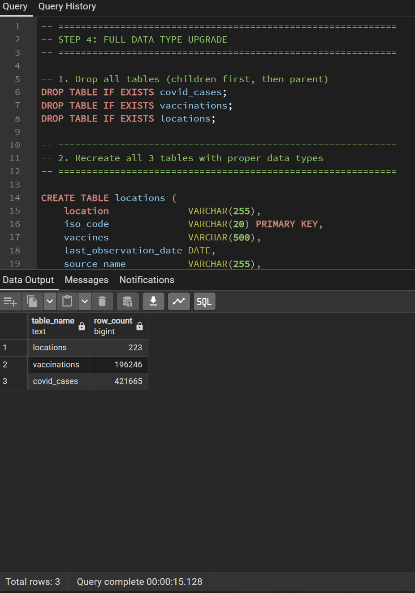

---

## Step 5 — Data Validation & Exploration

### 5a. Single Country Deep Dive (equivalent to professor's Fred Astaire query)

Just as the professor looked up Fred Astaire specifically to validate data relationships, I looked up the United States to validate my tables.

```sql
-- Get vaccines used in the US
SELECT location, vaccines
FROM locations
WHERE iso_code = 'USA';

**Screenshot — Vaccine used in the US:**

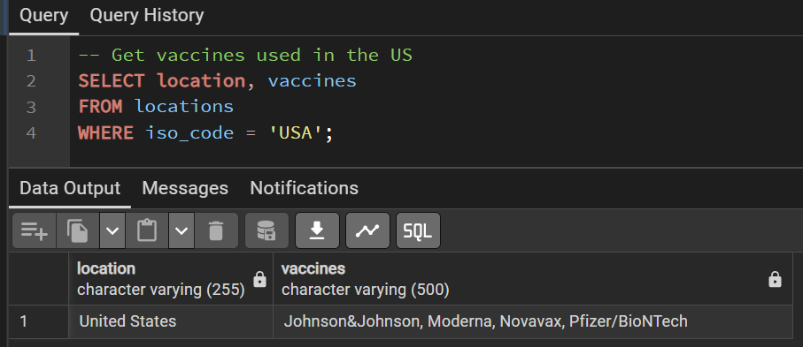

-- Split vaccine list into individual rows using unnest
SELECT location, unnest(string_to_array(vaccines, ', ')) AS individual_vaccine
FROM locations
WHERE iso_code = 'USA';
```

**Screenshot — Vaccine split result:**

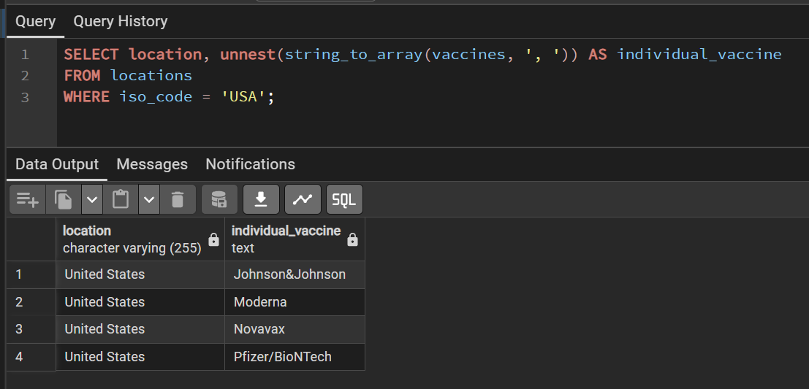

---

### 5b. Create a View linking all 3 tables

```sql
CREATE VIEW covid_full AS (
    SELECT
        l.iso_code,
        l.location,
        l.vaccines,
        c.case_date,
        c.new_cases,
        c.new_deaths,
        c.total_cases,
        c.total_deaths,
        c.hosp_patients,
        c.icu_patients,
        v.total_vaccinations,
        v.people_fully_vaccinated,
        v.daily_vaccinations
    FROM locations l
    LEFT JOIN covid_cases c   ON l.iso_code = c.iso_code
    LEFT JOIN vaccinations v  ON l.iso_code = v.iso_code
                              AND c.case_date = v.vax_date
);

SELECT COUNT(*) FROM covid_full;
```

**Screenshot — View created and row count:**

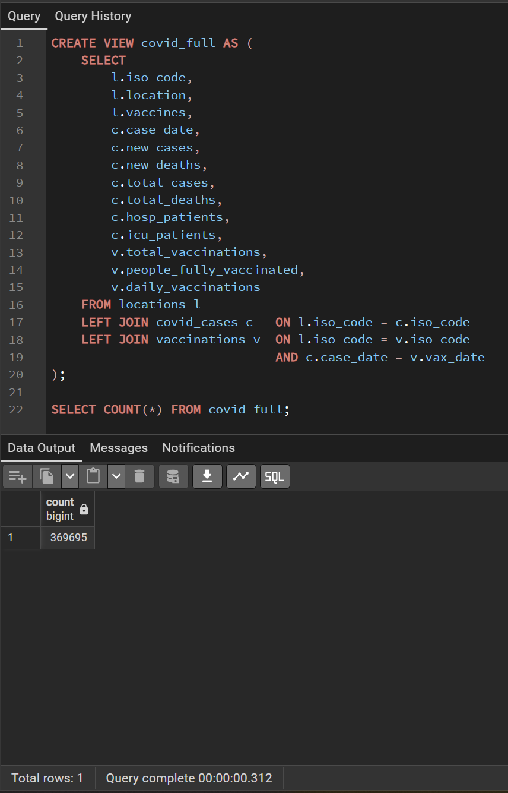

---

### 5c. JOIN Query — 2 Tables

```sql
-- Join covid_cases with locations to get full country name alongside case data
SELECT
    l.location,
    l.iso_code,
    c.case_date,
    c.new_cases,
    c.new_deaths,
    c.total_cases,
    c.total_deaths,
    c.hosp_patients,
    c.reproduction_rate
FROM covid_cases c
JOIN locations l ON c.iso_code = l.iso_code
WHERE l.location = 'United States'
  AND c.new_cases IS NOT NULL
ORDER BY c.case_date DESC
LIMIT 15;
```

**Screenshot — JOIN result:**

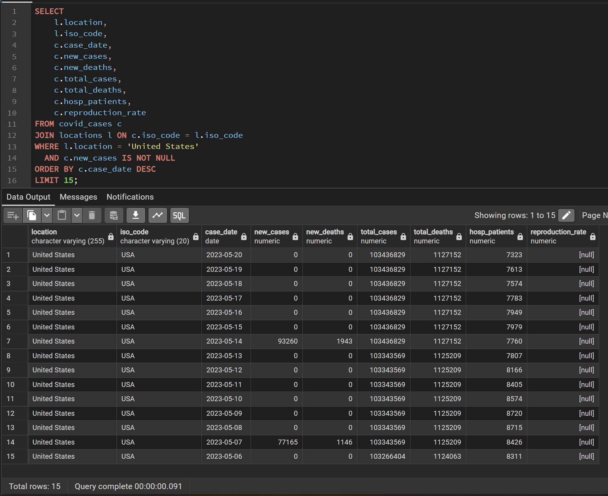

---

### 5d. JOIN Query — All 3 Tables

```sql
-- Join all 3 tables to see cases, deaths, and vaccinations side by side
SELECT
    l.location,
    l.iso_code,
    MAX(c.total_cases)                              AS peak_total_cases,
    MAX(c.total_deaths)                             AS peak_total_deaths,
    MAX(v.people_fully_vaccinated)                  AS peak_fully_vaccinated,
    ROUND(MAX(c.total_deaths) /
          NULLIF(MAX(c.total_cases), 0) * 100, 2)  AS case_fatality_rate_pct
FROM locations l
JOIN covid_cases c   ON l.iso_code = c.iso_code
JOIN vaccinations v  ON l.iso_code = v.iso_code
WHERE c.total_deaths IS NOT NULL
  AND c.total_cases  IS NOT NULL
GROUP BY l.location, l.iso_code
ORDER BY peak_total_deaths DESC
LIMIT 10;
```

**Screenshot — 3-table JOIN result:**

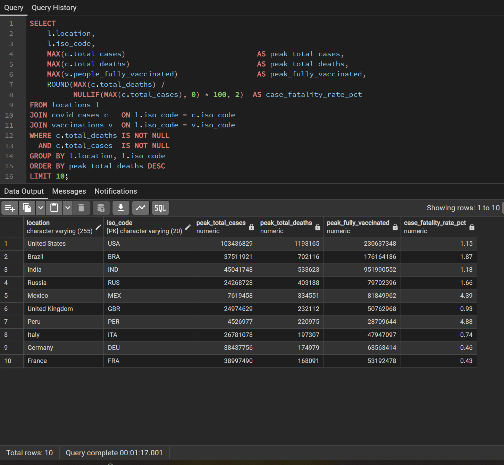

---

### 5e. Aggregated Query — Top 10 Countries by Total Deaths

```sql
SELECT
    l.location,
    l.iso_code,
    MAX(c.total_deaths) AS total_deaths
FROM locations l
JOIN covid_cases c ON l.iso_code = c.iso_code
WHERE c.total_deaths IS NOT NULL
GROUP BY l.location, l.iso_code
ORDER BY total_deaths DESC
LIMIT 10;
```

**Screenshot — Aggregated result:**

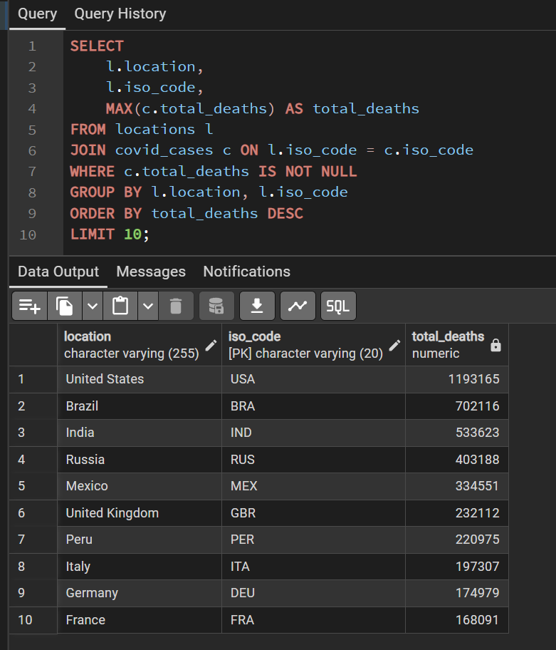

---

### 5f. Aggregated Query — Vaccination Progress by Country

```sql
SELECT
    l.location,
    MAX(c.population)                                        AS population,
    MAX(v.people_fully_vaccinated)                           AS fully_vaccinated,
    ROUND(
        MAX(v.people_fully_vaccinated) /
        NULLIF(MAX(c.population), 0) * 100
    , 2)                                                     AS pct_vaccinated
FROM locations l
JOIN vaccinations v ON l.iso_code = v.iso_code
JOIN covid_cases c  ON l.iso_code = c.iso_code
WHERE c.population IS NOT NULL
  AND v.people_fully_vaccinated IS NOT NULL
GROUP BY l.location
ORDER BY pct_vaccinated DESC
LIMIT 15;
```

**Screenshot — Vaccination rate result:**

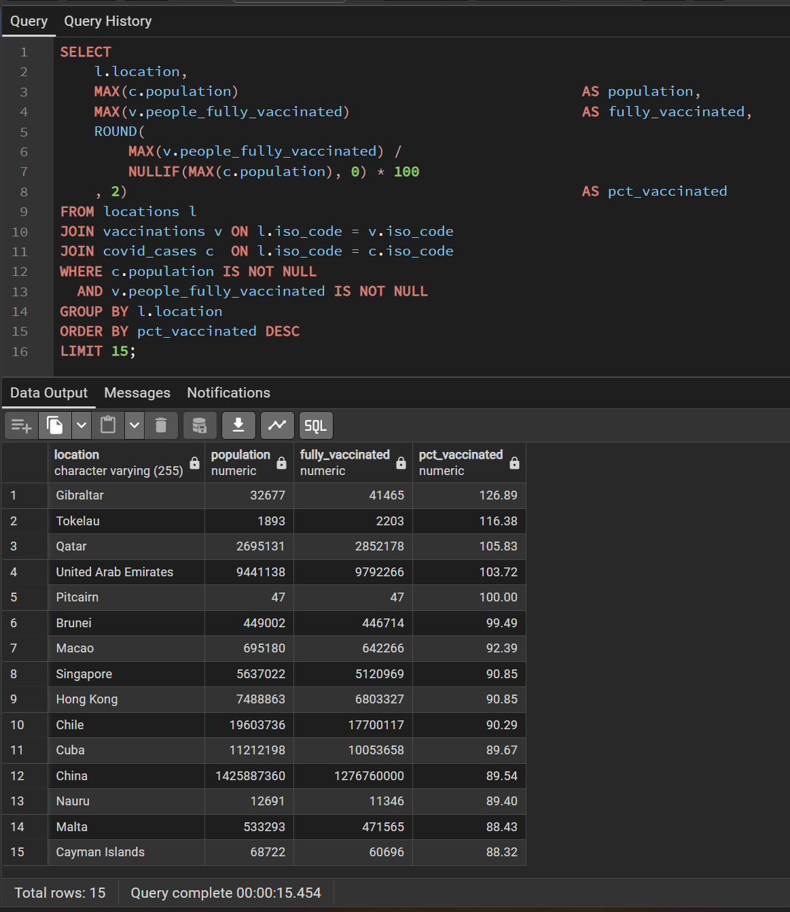

---
